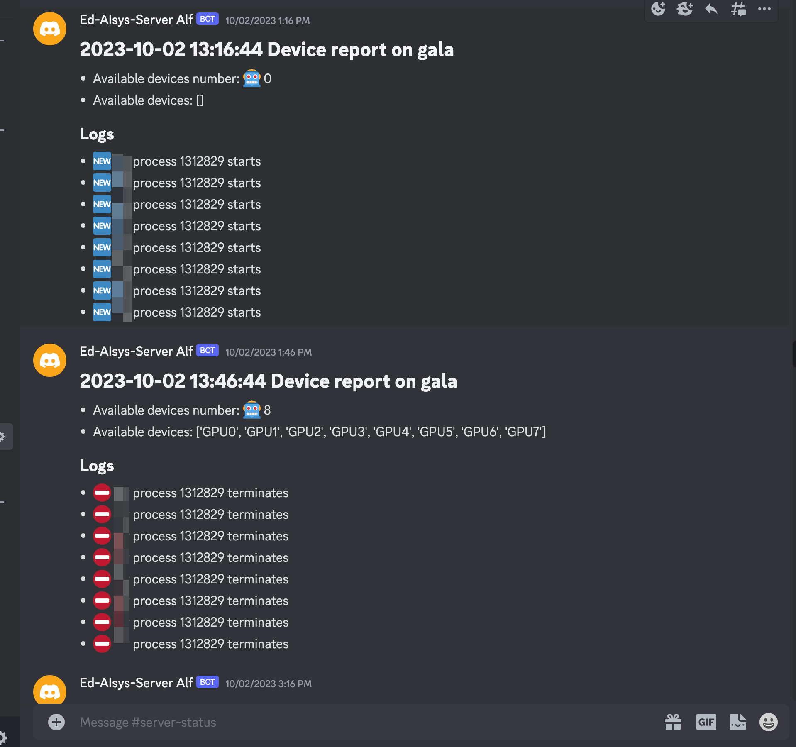
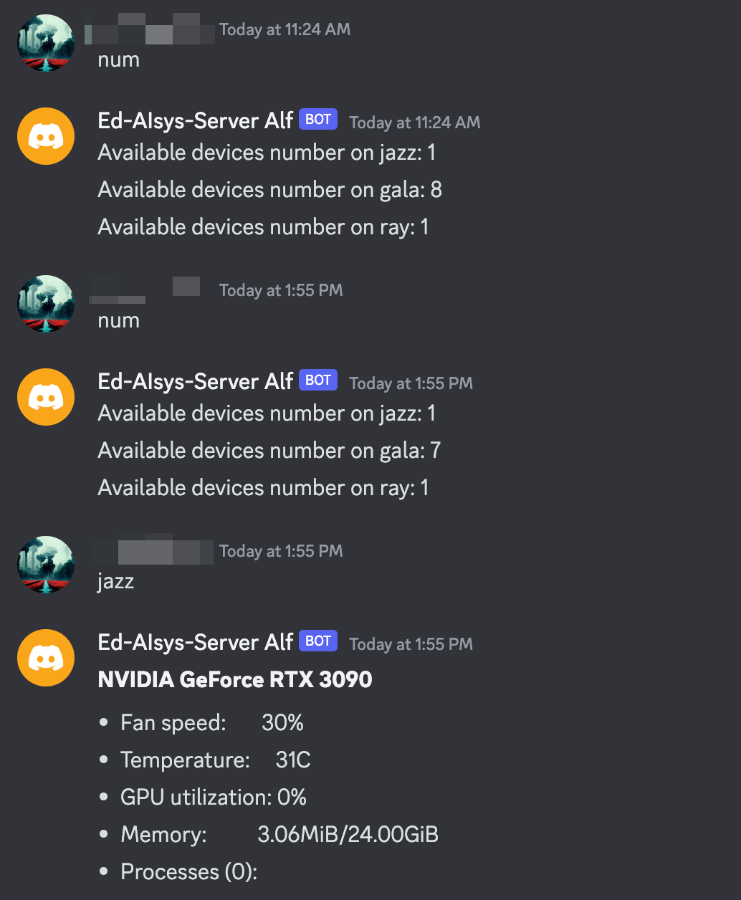

# Discord-NVITOP

## Project Glance

Get notified of your cluster's GPU usage information in a timely manner.

### Monitor Mode



### Interactive Mode



## Installation

```bash
pip install -r requirements.txt
python bot.py
```

## Config file

**Important: ** this project relies on a `config.json` file for discord bot information. Here is an example:

```json
{
    "token": "xxxxxxxxxxxxxxxxxxxxxxxxxx.xxxxxx.xxxxxxxxxxxxxxxxxxxxxxxxxxxxxxxxxxxxxx",
    "machine": "machine_name",
    "channel_id": 1000000000000
}
```

Related Links:

1. [Python Discord Bot Tutorial – Code a Discord Bot And Host it for Free](https://www.freecodecamp.org/news/create-a-discord-bot-with-python/) (Introduce how to create a discord bot)

2. [How to Find a Discord Channel ID: The Ultimate Guide - TurboFuture](https://turbofuture.com/internet/Discord-Channel-ID) (How to find channel_id)

3. [itsmehemant123/discord-nvidia-smi-bot: Show your GPU stats in discord](https://github.com/itsmehemant123/discord-nvidia-smi-bot/) (My reference project, thanks to itsmehemant123)
